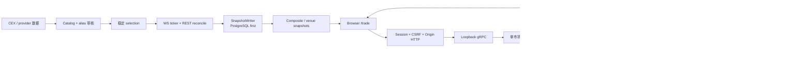

# Qiu Market 代码学习地图

- 代码基线：`882951845c1c0f247b9c80bdf3b6173fb6b13d22`
- 材料状态：`implemented`
- 当前个人掌握状态：`learning`
- 配套矩阵：[交易可靠性测试矩阵](02-trading-reliability-test-matrix.md)
- 配套口述：[90/60 秒面试训练](03-interview-rehearsal.md)

## 一张图看完整链路



读图时要主动区分两种 identity：

- 行情 identity 回答“这个 provider symbol 是哪个 canonical asset”；
- 交易 idempotency identity 回答“这是不是同一次业务写意图”。

两者都叫“身份”，但不能互相替代。

## 学习顺序

1. 先读行情身份与质量，理解输入事实是否可信；
2. 再读订单幂等，理解写请求如何避免重复副作用；
3. 再读部分成交与撤单，理解订单状态和资金义务如何变化；
4. 再读双重记账，理解每次状态变化如何形成可审计资金分录；
5. 最后读事件与恢复，把前四章串成可重放、可校验的系统。

---

## 第一章：行情身份与质量

### 学习目标

能解释为什么“拿到 BTCUSDT 价格”还不够：系统必须先证明 BTC/USDT 的 provider 身份、市场类型、rollout 和 selection，再决定报价是否新鲜、是否能进入综合现货价。

### 业务流程

1. provider adapter 发现市场目录；
2. 系统读取已审核 alias、Top 200 canonical 资产和 USD-family quote 规则；
3. 市场解析为 resolved、pending review、ambiguous 或 rejected；
4. rollout/selection 决定哪些资产可正式发布，selection 成员不因短暂价格故障消失；
5. WebSocket 事件与 REST reconcile 统一规范化为 snapshot；
6. PostgreSQL 先判断乱序/no-op/correction，接受后 Redis 才派生；
7. composite index 只使用合格的新鲜 CEX Spot；
8. HTTP 返回 provider、price kind、source time、freshness 和 available，而不是只给一个价格。

### 调用链：按这个顺序读

1. `crawler/catalog_supervisor.go::CatalogSupervisor.refreshProviderCatalog`
   - 调 adapter `Discover`，读取 approved aliases 与 Top 200；
   - 写 candidate、pending alias suggestion 和稳定 selection。
2. `crawler/catalog_supervisor.go::resolveDiscoveredMarkets`
   - 拒绝 Perp、非 USD-family quote 和不可交易市场；
   - symbol 唯一只能生成 pending alias，approved 后才 resolved。
3. `crawler/spot_ticker_supervisor.go::writeProviderTickers/normalizedTickerSnapshot`
   - 把 provider ticker 规范化为定点数字符串；
   - 保留 `source_time`、`source_time_kind`、open 和 nullable change。
4. `marketdata/snapshot_writer.go::SnapshotWriter.Write`
   - 调 `database/symbol_market.go::ApplyMarketSnapshot`；
   - PG 接受后才更新 Redis price/rank。
5. `marketdata/composite.go::CompositeIndexer.RunOnce/BuildComposite`
   - 构建 All composite 与四家独立 `venue_spot` snapshot；
   - `database/market_aggregation.go::QueryMarketPriceTicks` 和
     `services/http/service/market_index.go::GetMarketPriceTicks` 输出读模型。

### 关键结构

| 结构 | 作用 | 读代码时关注 |
|---|---|---|
| `crawler.DiscoveredMarket` | adapter 的原始市场发现 | source symbol、base/quote alias、market type、tradable |
| `database.ProviderMarketCandidate` | 待审核或已解析市场 | resolution status、rejection reason、canonical IDs |
| `database.AssetAlias` | provider alias 到 canonical asset 的审核映射 | `review_status` 不是自动批准 |
| `database.MarketSnapshotInput` | 当前行情写入事实 | observed/source time、open/change、active |
| `marketdata.CompositeCandidate` | 综合价候选 | Spot、price、turnover、freshness、quote rate |
| `marketdata.CompositeResult` | 综合价及审计解释 | contributor、exclusion、confidence |
| `database.MarketPriceTickRow` | 轻量实时读模型 | provider、price kind、version、available |

### 不变量

- 未审核 alias 不得创建正式 canonical market；
- Perp/DEX 不进入 All 综合现货价；
- selection 成员集合与当前价格是否可用分离；
- PostgreSQL 接受 snapshot 之前 Redis 不得先变“新”；
- composite 只使用 30 秒内的新鲜 Spot；
- USD-family rate 缺失、未来时间、非正价和 3% 中位数离群报价必须排除；
- 多交易对先按 venue 合并，不能让一家 venue 通过多个 quote pair 放大权重；
- Unknown change 不能伪造成 `0%`。

### 失败、降级与恢复

| 故障 | 系统行为 | 恢复 |
|---|---|---|
| alias ambiguous | candidate 留在审计区，不启用 | 人工审核 alias，下一次 catalog refresh 解析 |
| 单 venue WS 断线 | 该 source 降级；REST 只对账，不冒充 WS 已恢复 | supervisor 重连，其他 venue 继续 |
| snapshot 乱序 | PG 丢弃，Redis 不刷新 | 等待更晚的 source observation |
| Redis 不可用 | PG 真值保留，缓存写告警 | 从 PG 重建派生缓存 |
| 全部 Spot 过期 | composite `available=false` | 任一合格新鲜 Spot 恢复 |
| DEX route 失败 | 只降级 DEX route，不填进 CEX composite | 下一轮同 identity route 成功后恢复 |

### 实验

1. 身份门：

   ```bash
   go test ./crawler -run '^(TestResolveDiscoveredMarketsRequiresApprovedProviderAliases|TestResolveDiscoveredMarketsRejectsPerpAndNonUSDQuote)$'
   ```

   预期：pending alias 不会被误写成 resolved；Perp/非 USD quote 被拒绝。证据：`build-verified`。

2. PG-first snapshot：

   ```bash
   go test ./marketdata -run '^TestSnapshotWriter'
   go test ./database -run '^TestDecideMarketSnapshotOrderingAndCorrection$'
   ```

   预期：discarded observation 不刷新缓存；乱序与 correction 规则确定。证据：`build-verified`。

3. 综合价质量门：

   ```bash
   go test ./marketdata -run '^TestBuildComposite'
   ```

   预期：Perp、stale、outlier 和缺 rate 被排除；confidence 按 venue 数。证据：`build-verified`。

4. 可选真实 PostgreSQL tick identity：

   ```bash
   S78_TEST_DATABASE_DSN='<isolated test database>' \
     go test -v ./database -run '^TestIntegrationMarketPriceTicksKeepVenueIdentityAndFreshness$'
   ```

   只有外部提供隔离 DSN 且测试实际运行通过，才标 `integration-verified`；`SKIP` 不算。本学习任务不读取 `.env`。

### 闭卷自测

1. 为什么 symbol 唯一仍只能生成 pending alias？
2. 为什么 selection 有 50 个资产不等于 50 个资产当前都有价格？
3. PG 成功、Redis 失败时哪边是真值？
4. 为什么 Binance 和 Coinbase 各自的 BTC/USDT 不能被当成两个 venue 权重？
5. 指出 composite 的五个排除条件和一个恢复路径。

### 掌握状态

- 材料：`implemented`
- 分层实验：`build-verified`
- 真实外部行情与 PostgreSQL：仓库已有 `integration-verified` 记录；本章实验未在本任务重跑
- 长期 provider canary / SLA：`environment-pending`
- 个人：`learning`；完成两次 [60 秒行情复述](03-interview-rehearsal.md#60-秒一行情身份与质量) 后再评估

---

## 第二章：订单幂等与 Unknown

### 学习目标

能解释下单、撤单、虚拟入金在“已提交、响应丢失”后如何使用原身份收敛，而且不会把浏览器 pending 当成服务端真值。

### 业务流程

1. 浏览器在发送前生成 `client_order_id` 或 request ID；
2. HTTP 用 session 决定 actor/account，校验 CSRF、Origin 和写限流；
3. gRPC 把十进制字符串转换为整数 atom；
4. MarketRunner 把命令放进有界队列；
5. Exchange 构造四元组幂等键并查询历史 result；
6. 新命令在 trial state 执行，PostgreSQL 事务提交成功后内存才前进；
7. 网络或 commit 结果未知时保存原 ID、恢复事件真值；
8. reconcile 按 submit/cancel/fund 分别查询或同 ID 重放。

### 调用链：按这个顺序读

1. `frontend/src/views/Trade.vue::submitOrder/cancelOrder/fundVirtual`
   - 发送前固定 request identity；
   - uncertain 错误调用 `storePendingWrite`。
2. `frontend/src/api/trading.ts::request`
   - fetch error 和 502/503/504 对写请求标 `uncertain=true`；
   - 本层没有写自动重试。
3. `trading/httpapi/api.go::submitOrder/cancelOrder/fundVirtual`
   - submit/cancel 从服务端 session 取 account；
   - fund 区分 admin actor 与 target subject。
4. `trading/runtime/runner.go::execute/handle`
   - 有界队列、单 writer、背压；
   - persistence error 后调用 `recoverAfterPersistenceError`。
5. `trading/exchange/exchange.go::Fund/Submit/Cancel/runLocked`
   - 构造 `domain.IdempotencyKey`；
   - 历史同 fingerprint 返回原 result，异 fingerprint 拒绝；
   - `trading/store/postgres/store.go::Append` 用数据库唯一约束跨重启兜底。

### 关键结构

| 结构 | 作用 | 读代码时关注 |
|---|---|---|
| `PendingTradingWrite` | 浏览器持有的 unknown 操作 | actor、operation、request ID、payload、order ID |
| `TradingRequestError` | 传输错误分类 | `uncertain` 只对写边界有意义 |
| `domain.IdempotencyKey` | 服务端幂等作用域 | market、account、operation、request ID |
| `domain.Command` | 持久化命令 | request key、fingerprint、sequence、typed payload |
| `store.Record` | 一条 event batch 真值 | command、result、journal、projection、state hash |
| `runtime.Status` | runner 可写状态 | ready/recovering/failed、sequence、incident |

数据库底线位于 `migrations/2026082100023.sql`：

```text
UNIQUE (market_id, account_id, operation, request_id)
```

### 不变量

- 同键同 payload 返回原 result，不生成第二个 sequence；
- 同键异 payload 必须冲突；
- submit 的 request ID 等于 client order ID；
- actor 不能核对另一个 actor 的 pending；
- fund 的 target subject 决定服务端幂等 account，不能被 actor 覆盖；
- uncertain 状态不自动生成新 ID；
- persistence 结果不确定时 runner 必须先恢复，不能继续正常接单。

### 失败、降级与恢复

| 故障 | 系统行为 | 恢复 |
|---|---|---|
| 浏览器 fetch error / 504 | 保存 pending，锁定新写 | 原 actor 点击核对或订单视图自动收敛 |
| submit unknown | 同 ID 重放或查 client order ID | 返回原 result/order |
| cancel unknown | 先 GetOrder；open/partial 才同 ID cancel | terminal fact 或原 cancel result |
| fund unknown | 不从余额猜结果 | 原 fund ID 重放；完整目标是 request/ledger 查询 |
| PostgreSQL commit unknown | runner recovering | `exchange.Restore` 后回 ready |
| 同 ID 异 payload | 明确 conflict | 调用方修正业务错误，不能换 ID 掩盖 |

### 实验

1. 客户端 unknown：

   ```bash
   cd frontend
   npm test -- --run src/api/trading.test.ts src/trading/pending-write.test.ts
   ```

   预期：写 transport failure 只调用一次；submit/cancel 用订单事实；fund 不从余额猜测。证据：`build-verified`。

2. 服务端幂等：

   ```bash
   go test ./trading/exchange \
     -run '^(TestIdempotencyAndConcurrentRetry|TestScopedIdempotencyAndQueryViews)$'
   ```

   预期：并发同 ID 只有一个 sequence；跨 account 不碰撞。证据：`build-verified`。

3. commit unknown 恢复：

   ```bash
   go test ./trading/runtime \
     -run '^TestMarketRunnerRecoversUnknownCommitAndRetryIsIdempotent$'
   ```

   预期：store 先 append 再返回错误，runner 恢复到 sequence 1，原 fund ID 不重复入账。证据：`build-verified`。

4. 可选真实 PostgreSQL：

   ```bash
   S78_TEST_POSTGRES_DSN='<isolated test database>' \
     go test -v ./trading/e2e \
     -run '^TestVirtualSpotTransportTradeFeesCancelAndRestart$'
   ```

   预期：丢 fund 响应、同 ID 重放、跨重启后仍只有一批事件和两条对平分录。实际运行通过才是 `integration-verified`。

### 闭卷自测

1. 四元组为什么必须包含 account 和 operation？
2. 为什么 cancel 要先查 order，而 fund 当前只能同 ID 重放？
3. actor 与 fund subject 分别控制什么？
4. commit unknown 后 runner 为什么不能直接把 trial state 留在内存？
5. sessionStorage、数据库唯一约束和 event stream 分别解决哪一层问题？

### 掌握状态

- 代码：`implemented`
- 本任务 unit/Vitest：`build-verified`
- 既有 PostgreSQL 与 exact Preview Gate 2C：`integration-verified`
- fund request/ledger 直查、Production 长期证据：`environment-pending`
- 个人：`learning`；完成 [60 秒幂等复述](03-interview-rehearsal.md#60-秒二订单幂等与-unknown) 和一次失败链白板后再评估

---

## 第三章：部分成交与撤单竞态

### 学习目标

能把“并发撤单”翻译成确定的 sequence 顺序，画出 fill 前后 order、held、trade 和 ledger 如何变化，并指出当前组合测试缺口。

### 业务流程

以一个卖单剩余 `Q` 为例：

1. maker submit 后冻结 `Q` 个 base atoms，订单进入 book；
2. taker 到来，`Book.Match` 按价格和 FIFO 产生一个或多个 `RawFill`；
3. 每个 fill 立即形成 Trade、费用和双资产 ledger transaction；
4. maker 的 filled 增加、remaining/held 减少；
5. remaining > 0 时订单成为 partially-filled 并继续 resting；
6. cancel 到来时只移除 remaining，并把剩余 held 释放回 available；
7. 如果 cancel sequence 在 taker 之前，订单先离开 book，后续 taker 不应再匹配它。

### 调用链：按这个顺序读

1. `trading/orderbook/orderbook.go::Book.Match`
   - `bestOpposing` 选价位；
   - `executableQuantity` 处理数量、budget 和 self-trade stop reason。
2. `trading/exchange/orders.go::applySubmit`
   - 预检查 Post Only/FOK，调用 `reserveFor` 和 `ledger.Hold`；
   - 遍历 fills 更新 maker/taker。
3. `trading/exchange/orders.go::settleFill`
   - 区分 buyer/seller 与 Maker/Taker role；
   - 生成费用与对平分录。
4. `trading/exchange/orders.go::releaseExcessBuyHold/applyCancel`
   - 价格改善/舍入释放；
   - cancel 只释放订单当前 `HeldAmount`。
5. `trading/rpc/server/server.go::CancelOrder`
   - owner 预检查；
   - 让 Exchange 的幂等查询先于 closed-state 判断。

### 关键结构

| 结构 | 作用 | 读代码时关注 |
|---|---|---|
| `domain.Order` | 订单完整状态 | original/remaining/filled、held、status、sequence |
| `orderbook.RawFill` | 撮合器输出 | maker ID、price、quantity、quote amount、maker remaining |
| `orderbook.MatchResult` | 多 fill + stop reason | self trade、budget exhausted |
| `domain.Trade` | 已成交不可变事实 | maker/taker、buyer/seller、两种 fee |
| `domain.Result` | 一个命令的外部结果 | sequence、order ID、status、events |

### 两种顺序

| 顺序 | 结果 |
|---|---|
| fill → cancel | fill 永久清算；remaining order 取消；只释放 remaining held |
| cancel → taker | maker 先从 book 删除并释放 held；taker 不能成交它 |

因为一个市场只有一个 runner writer，两种顺序都应是确定结果；这不等于两种顺序都已有完整测试。

### 不变量

- 同价 FIFO 不能因取消中间订单而重排幸存订单；
- filled quantity + remaining quantity = original quantity（适用 base quantity 订单）；
- 已成交 Trade 不因后续 cancel 消失；
- open/partially-filled order 的 held 覆盖剩余最坏义务；
- cancel 只释放一次剩余 held；
- 同 cancel ID 返回原结果，新 cancel ID 对 closed order 才拒绝；
- 任一 sequence 结束后 orderbook、order index、ledger 都能通过 validate。

### 失败、降级与恢复

| 故障 | 系统行为 | 恢复 |
|---|---|---|
| cancel response lost, order terminal | 只查到终态，不发第二次 cancel | 清 pending，刷新 trade/balance |
| cancel response lost, order still open/partial | 原 cancel ID 重放 | 幂等返回同一结果 |
| queue full | 立即 `ErrQueueFull` | 调用方保留原 ID，有界重试 |
| mid-command 业务错误 | trial state 丢弃 | 正式 state 不变 |
| persistence unknown | runner recovering | event replay 决定 fill/cancel 谁已提交 |

### 实验

1. FIFO 与 partial fill：

   ```bash
   go test ./trading/orderbook \
     -run '^(TestPriceTimePriorityAndPartialFill|TestCancelPreservesFIFO)$'
   ```

2. 资金、费用与 fill-before-cancel：

   ```bash
   go test ./trading/exchange \
     -run '^TestPriceTimeSettlementFeesAndCancel$'
   ```

3. cancel 幂等先于 closed check：

   ```bash
   go test ./trading/rpc/server \
     -run '^TestCancelOrderIdempotencyPrecedesClosedStateCheck$'
   ```

4. 浏览器两种响应丢失：

   ```bash
   cd frontend
   npx playwright test e2e/trading.spec.ts \
     --grep 'cancel fact|open cancel unknown'
   ```

这些实验当前为 `build-verified`。它们没有组成“真实 PG + 两种顺序 + response loss + restart + ledger/hash”的单一 E2E，所以不能把完整竞态标成 integration 完成。

### 闭卷自测

1. 为什么 Go race detector 不能证明业务顺序正确？
2. fill 先到后，cancel 具体释放哪一笔义务？
3. 同 cancel ID 与新 cancel ID 对 closed order 的结果为何不同？
4. buy maker 发生价格改善时，为什么还要 `releaseExcessBuyHold`？
5. 设计一个单一 PostgreSQL E2E，必须断言哪些字段？

### 掌握状态

- FIFO、部分成交、顺序化 runner：`implemented`
- 当前分层测试：`build-verified`
- 完整 partial-fill/cancel 组合：`environment-pending`
- 补一个组合测试：`production-recommendation`
- 个人：`learning`；能闭卷画两种 sequence 和 held 变化后再评估

---

## 第四章：双重记账

### 学习目标

能解释 available、held、treasury、fee 四类账户为什么不是四个随手改的数字，以及一笔成交如何在 BTC 与 USDT 两种资产上分别对平。

### 业务流程

1. 虚拟入金：`system:treasury:<asset>` 记负，用户 available 记正；
2. 下单冻结：用户 available 记负，用户 held 记正；
3. 成交：
   - 买方 held USDT 记负；
   - 卖方 available USDT 与平台 USDT fee 合计记正；
   - 卖方 held BTC 记负；
   - 买方 available BTC 与平台 BTC fee 合计记正；
4. 撤单/IOC 余量/价格改善：held 记负，available 记正；
5. journal delta 与 balance projection 随 event batch 一起提交。

### 调用链：按这个顺序读

1. `trading/ledger/ledger.go::Ledger.Post`
   - 在临时 sums/pending map 中检查；
   - 所有检查通过后才写 balances/journal。
2. `trading/ledger/ledger.go::FundVirtual/Hold/Release`
   - 都归一为至少两条 Entry 的 Transaction。
3. `trading/exchange/orders.go::reserveFor/settleFill`
   - 冻结单位取决于 side/order type；
   - 买方 fee 从 base、卖方 fee 从 quote 扣除。
4. `trading/exchange/exchange.go::runLocked/buildProjection`
   - 从 trial ledger 提取 journal delta 与受影响 balance。
5. `trading/store/postgres/store.go::Append/applyProjection`
   - event、ledger entries、order/trade/balance、outbox、sequence CAS 同事务。

### 关键结构

| 结构 | 作用 | 读代码时关注 |
|---|---|---|
| `ledger.Entry` | 一个账户、一个资产的增减 | amount 可正可负但不能为零 |
| `ledger.Transaction` | 同一业务原子的分录组 | ID、reference、至少两条 entries |
| `ledger.Balance` | 账户/资产当前余额 | 从 journal 可重算 |
| `ledger.Ledger` | 内存账本 | balances、journal、transaction IDs |
| `store.BalanceProjection` | 用户 available/held 读模型 | 非负、按 sequence 更新 |
| `store.Projection` | 受影响订单/成交/余额 | 可从 event 重建 |

### 不变量

- 每笔 transaction 对每个 asset 的 entry sum = 0；
- 用户 available/held 不能为负；
- 只有 `system:treasury:` 允许负余额，代表虚拟发行对手；
- transaction ID 不得重复；
- 失败 transaction 不得部分改变余额；
- 买单冻结向上取整，结算向下取整，余量必须释放；
- balance projection 与 runtime ledger 在同 sequence 一致；
- event stream 能重建 ledger projection。

### 失败、降级与恢复

| 故障 | 系统行为 | 恢复 |
|---|---|---|
| 分录不平衡 | `Ledger.Post` 整笔拒绝 | 修正业务分录，不能补一条隐藏 adjustment |
| 用户余额不足 | hold 拒绝，订单 rejected | 真实虚拟入金后用新业务意图提交 |
| transaction ID 重复 | 明确 duplicate | 查原 event/request，不生成“修复 ID” |
| projection 损坏 | runtime/event 真值不丢 | `RebuildProjections` 从 event 重建 |
| commit unknown | 不确定是否已入账 | runner 恢复，按原 request ID 查询 |

### 实验

1. Ledger 原子性：

   ```bash
   go test ./trading/ledger \
     -run '^(TestLedgerPostingAndSnapshot|TestLedgerRejectsUnbalancedAndNegativeTransactions|TestDuplicateTransactionIsRejected)$'
   ```

2. 成交费用与解冻：

   ```bash
   go test ./trading/exchange \
     -run '^(TestPriceTimeSettlementFeesAndCancel|TestDifferentAssetScalesReleaseRoundingDust)$'
   ```

3. 可选真实 PostgreSQL projection/rebuild：

   ```bash
   S78_TEST_POSTGRES_DSN='<isolated test database>' \
     go test -v ./trading/store/postgres \
     -run '^TestPostgresEventSnapshotOutboxAndRecovery$'
   ```

   实际运行会删除/重建隔离测试 market 的投影；不得指向共享或生产数据库。

### 手算练习

用测试市场的简化整数解释：

```text
buyer held USDT      -100
seller available USDT +99
platform fee USDT      +1
--------------------------
USDT sum                0

seller held BTC       -10
buyer available BTC    +9
platform fee BTC       +1
--------------------------
BTC sum                 0
```

真实费率和舍入以 market config、`FeeAmount` 与 `QuoteAmountFloor/Ceil` 为准，手算例子只练分录方向。

### 闭卷自测

1. 为什么虚拟入金需要 treasury 对手账户？
2. 为什么 available/held 是账户，不只是 Order 上两个字段？
3. 买方和卖方费用分别从哪种资产扣？
4. 为什么 projection 损坏可以重建，ledger 历史不能靠 projection 反推成真值？
5. `Ledger.Post` 如何保证失败不发生部分更新？

### 掌握状态

- 账本与同事务 projection：`implemented`
- unit：`build-verified`
- 既有真实 PostgreSQL fund/restart：`integration-verified`
- 在线 request-to-ledger 查询：`environment-pending`
- 个人：`learning`；能手算两资产六条分录并解释舍入后再评估

---

## 第五章：快照、事件与恢复

### 学习目标

能解释 event stream、snapshot、projection、outbox/event feed 的所有权差异；遇到 commit unknown、快照损坏、断线时能指出 fail-closed 恢复顺序。

### 业务流程

1. `NewMarketRunner` 启动时先调用 `exchange.Restore`；
2. Restore 加载 snapshot，校验 schema、market、sequence 和 hash；
3. 读取 snapshot 之后的 event records；
4. 按 sequence 重放 command，重新计算 result、journal、projection 与 state hash；
5. 任一不一致就启动失败，恢复成功后 runner 才 ready；
6. 新命令在 trial state 执行，event batch 提交成功后正式内存前进；
7. 每 100 条命令和优雅退出保存 snapshot；
8. outbox publisher 把 committed events 幂等写进 event feed并推进 checkpoint；
9. gRPC/WebSocket 按 `(sequence,event_index)` 从 cursor 之后续读。

### 调用链：按这个顺序读

1. `trading/runtime/runner.go::NewMarketRunner`
   - 调 Restore；
   - 创建有界 queue，启动唯一 loop。
2. `trading/exchange/exchange.go::Restore`
   - Load snapshot；
   - RecordsAfter；
   - replay + result/journal/projection/hash 比对。
3. `trading/store/postgres/store.go::Append/Save/Load/RecordsAfter`
   - stream row lock + sequence CAS；
   - commit error 归类为 `ErrCommitOutcomeUnknown`。
4. `trading/runtime/runner.go::handle/recoverAfterPersistenceError`
   - persistence error 后进入 recovering；
   - 恢复失败进入 failed 且停止 accepting。
5. `trading/store/postgres/store.go::PublishOutboxBatch/FeedAfter`
   - 与 `trading/outbox/publisher.go::Publisher.Run` 组成持久 delivery；
   - `trading/rpc/server/server.go::SubscribeEvents` 从 cursor 推送。

### 关键结构

| 结构 | 作用 | 读代码时关注 |
|---|---|---|
| `store.Record` | 一个 sequence 的最终真值 | schema、command/result、journal、projection、hash |
| `store.Snapshot` | 某 sequence 的完整状态缓存 | schema、market、sequence、hash、payload |
| `runtime.Status` | runner 生命周期 | ready/recovering/failed/closing/closed |
| `postgres.Cursor` | event feed 位置 | sequence + event index |
| `postgres.OutboxEvent` | 待发布或已发布事件 | identity 与 published time |
| `postgres.ProjectionCheckpoint` | 读模型消费位置 | sequence/event index |

### 所有权

| 数据 | 是否最终交易真值 | 能否重建 | 主要用途 |
|---|---|---|---|
| event batch | 是 | 不能用 projection 反造 | 审计与确定性恢复 |
| snapshot | 否 | 可由 event 重放生成 | 缩短启动时间 |
| order/trade/balance projection | 否 | 可由 event 重建 | 快速查询 |
| outbox source | 与 event 同事务的 delivery intent | 可从 event/result 设计恢复，但当前保留源行 24h | 发布输入 |
| event feed | 持久 cursor 消费源 | 由 publisher 从 outbox 写入 | WebSocket/polling replay |

### 不变量

- sequence 严格单调且无洞；
- snapshot payload hash 等于 snapshot metadata hash；
- replay result、journal、projection、state hash 等于持久 record；
- snapshot schema 升级必须先验证旧 replay；
- commit unknown 后只能由 event stream 决定是否已提交；
- feed identity 等于 event 的 `(sequence,event_index,type)`；
- checkpoint 只前进不后退；
- runner 未 ready 时拒绝交易写。

### 失败、降级与恢复

| 故障 | 系统行为 | 恢复 |
|---|---|---|
| snapshot hash 错 | fail closed | 从可信 event/backup 恢复，不能忽略 hash |
| event result/hash 错 | fail closed | 恢复可信备份或修复介质 |
| commit outcome unknown | runner recovering | Restore 后同 ID 查询 |
| outbox publish 暂时失败 | event batch 已安全提交，publisher 记录 error | 下一轮幂等 publish，checkpoint 前进 |
| WebSocket 断线 | UI 保留 cursor，换新 ticket | 从 cursor 后续读 |
| browser reconnect 去重未验证 | 不得声称端到端不丢不重 | 补真实断线/重连浏览器 E2E |

### 实验

1. 快照重放与损坏：

   ```bash
   go test ./trading/exchange \
     -run '^(TestSnapshotReplayAndCorruptionDetection|TestRestoreVerifiesLegacyReplayAtUpgradeBoundary|TestRestoreUpgradesLegacySnapshotWithoutDeletingAuditableUserState)$'
   ```

2. runner unknown 与优雅关闭：

   ```bash
   go test ./trading/runtime \
     -run '^(TestMarketRunnerRecoversUnknownCommitAndRetryIsIdempotent|TestMarketRunnerBackpressureAndGracefulSnapshot)$'
   ```

3. outbox 与 cursor：

   ```bash
   go test ./trading/outbox
   go test ./trading/rpc/server \
     -run '^TestTradingGRPCSubscribeEventsFromCursor$'
   ```

4. 可选真实 PostgreSQL restart：

   ```bash
   S78_TEST_POSTGRES_DSN='<isolated test database>' \
   S78_TEST_POSTGRES_ISOLATED=1 \
     go test -v ./trading/integration \
     -run '^TestCanonicalMigrationIntegratedGatewayAndRestartRecovery$'
   ```

   该测试要求隔离空库并会应用 canonical migration；绝不能指向共享或生产数据库。

### 闭卷自测

1. 为什么 snapshot 不是最终真值？
2. replay 要比较哪四类结果？
3. commit unknown 时为什么不能信 trial memory？
4. outbox 与 event feed 为什么分开？
5. cursor 为什么需要 sequence 和 event index 两个维度？
6. 哪个测试能证明浏览器真断线后不丢不重？当前答案为什么是“没有”？

### 掌握状态

- deterministic restore/outbox/feed：`implemented`
- unit/contract：`build-verified`
- 既有真实 PostgreSQL restart 和 Mac mini restore：`integration-verified`
- 浏览器 reconnect、跨机 DR、长期 RPO/RTO：`environment-pending`
- 个人：`learning`；能闭卷画出五种数据所有权和 fail-closed 顺序后再评估

---

## 跨章设计决策

| 决策 | 被拒绝方案 | 收益 | 成本与边界 |
|---|---|---|---|
| canonical identity 必须审核 | 按 symbol 自动猜资产 | 防同名资产污染 | 需要 catalog/alias 审核流程 |
| PG-first snapshot | Redis 先写再补 PG | 缓存不会比真值更新 | Redis 派生失败需重建 |
| 单市场串行 runner | 多 goroutine 直接改 book | FIFO/sequence/replay 确定 | 单市场吞吐受一个 writer 限制 |
| 原 ID reconcile | 超时后新 ID 自动重试 | 避免重复副作用 | UI/服务端都要保存身份 |
| 每资产对平 ledger | 直接改 balance | 审计、恢复、不变量明确 | 每个动作产生更多分录 |
| event stream 真值 | projection 或 snapshot 当真值 | 可确定重放与发现损坏 | 事务、存储和 replay 成本更高 |
| outbox → event feed | 浏览器直接读短期 outbox | cursor 与 cleanup 解耦 | 多一个 publisher/checkpoint |

## 总验收

### 代码定位

闭卷随机抽一个主题，必须在两分钟内：

1. 指出三至五个入口；
2. 按顺序解释调用；
3. 指出一个关键结构；
4. 说出两个不变量；
5. 定位一个真实测试。

### 实验证据

- 无外部依赖实验通过：最多升级到 `build-verified`；
- 真实 PostgreSQL/HTTP/OAuth/Preview 实际交换数据并核对：才是 `integration-verified`；
- 没有 Production promotion、长期观察或断线闭环：保持 `environment-pending`；
- “下一步应该补”统一写 `production-recommendation`。

### Mastery 门

| 主题 | 当前 | 升级为 `mastered` 的动作 |
|---|---|---|
| 行情身份与质量 | `learning` | 画 catalog→snapshot→composite，并解释 5 个排除条件 |
| 订单幂等 | `learning` | 演示一次 unknown 失败链，讲清 actor/subject |
| 部分成交/撤单 | `learning` | 手画两种 sequence 和 held 变化，指出组合测试缺口 |
| 双重记账 | `learning` | 手算 BTC/USDT 分录，逐资产和为零 |
| 事件恢复 | `learning` | 画 event/snapshot/projection/outbox/feed 所有权与 fail-closed |

材料、测试或录音存在都不自动改变这个表；必须闭卷完成动作并由 Owner 自己确认。

## 下一周一个学习闭环

只做一个闭环：**partial fill / cancel 双顺序可靠性**。

1. 第 1 天：读 `Book.Match`、`applySubmit`、`settleFill`、`applyCancel`，手画两种 sequence；
2. 第 2 天：跑 P1–P3 分层测试，逐项写出 order/held/ledger 变化；
3. 第 3 天：设计一个隔离 PostgreSQL 组合测试，先写断言清单，不改生产代码；
4. 第 4 天：实现 fill-before-cancel 与 cancel-before-fill；
5. 第 5 天：加入 cancel response loss、restart、state hash 与 ledger 对平；
6. 第 6 天：执行真实隔离 PG 验证，诚实记录 pass/skip/failure；
7. 第 7 天：60 秒闭卷复述并回填矩阵证据。

完成标准不是“新增一个 test file”，而是一个测试能在同一 harness 中证明订单终态、filled/remaining、available/held、ledger 和恢复 hash 一致。
